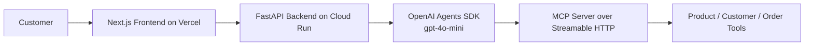

# Meridian Support AI

Meridian Support AI is an assessment project for Meridian Electronics. It provides a customer support chatbot that can search products, look up product details, verify customers with email and PIN, review order history, and place orders through an MCP server.

Frontend URL: https://mcp-project-beige.vercel.app  
Backend URL: https://meridian-support-backend-156986519612.us-central1.run.app

## Business Problem

Meridian Electronics receives repetitive support requests about product availability, product details, order history, and ordering. Handling those requests manually adds wait time for customers and operational overhead for the support team.

## Solution Overview

This project wraps Meridian's internal MCP tools behind a simpler support experience:

- The frontend presents a single-page support chat UI.
- The backend runs a FastAPI API and an OpenAI Agents SDK support agent.
- The agent calls the MCP server when it needs real product, customer, or order data.
- Customer verification is handled through the MCP layer using email and PIN.

## Architecture



## Tech Stack

- Frontend: Next.js App Router, React, TypeScript, Tailwind, shadcn-style UI primitives
- Backend: FastAPI, Python 3.12, OpenAI Agents SDK, uv
- Tool layer: MCP server over Streamable HTTP
- Model: `gpt-4o-mini`
- CI/CD: GitHub Actions
- Frontend deployment: Vercel GitHub integration
- Backend deployment: Google Cloud Run

## MCP Tools Discovered

- `list_products`
- `get_product`
- `search_products`
- `get_customer`
- `verify_customer_pin`
- `list_orders`
- `get_order`
- `create_order`

## Key Customer Workflows

- Search Meridian's product catalog by category or keyword
- Look up a specific product by SKU
- Verify a customer with email and PIN before order-specific support
- Retrieve customer order history after verification
- Place new orders where the MCP server supports it

## Demo Prompts

- `Get product details for SKU MON-0054.`
- `Search for computers and summarize available options.`
- `My email is donaldgarcia@example.net and my PIN is 7912. Verify me and show my order history.`

## Repository Structure

- `frontend/`: Next.js support UI
- `backend/`: FastAPI API, agent service, MCP service, tests, Dockerfile
- `.github/workflows/`: backend CI, frontend CI, backend deploy workflow

## Local Development Setup

### Backend

```bash
cd backend
cp .env.example .env
uv sync --dev
uv run uvicorn app.main:app --reload
```

Backend runs on `http://localhost:8000`.

### Frontend

```bash
cd frontend
cp .env.example .env.local
npm ci
npm run dev
```

Frontend runs on `http://localhost:3000`.

## Backend Environment Variables

Defined in [backend/.env.example](/home/steve/Projects/mcp-project/backend/.env.example):

- `OPENAI_API_KEY`
- `MCP_SERVER_URL`
- `CORS_ALLOWED_ORIGINS`

Example:

```env
OPENAI_API_KEY=
MCP_SERVER_URL=https://order-mcp-74afyau24q-uc.a.run.app/mcp
CORS_ALLOWED_ORIGINS=http://localhost:3000
```

## Frontend Environment Variables

Defined in [frontend/.env.example](/home/steve/Projects/mcp-project/frontend/.env.example):

- `NEXT_PUBLIC_API_URL`

Example:

```env
NEXT_PUBLIC_API_URL=http://localhost:8000
```

## Running Tests

### Backend

```bash
cd backend
uv run ruff check .
uv run pytest
```

The backend tests mock external agent and MCP dependencies, so they do not require `OPENAI_API_KEY` or `MCP_SERVER_URL`.

### Frontend

```bash
cd frontend
npm run build
```

## CI/CD

### Backend CI

[.github/workflows/backend-ci.yml](/home/steve/Projects/mcp-project/.github/workflows/backend-ci.yml) runs on:

- push to `main`
- pull requests that touch `backend/**`

It:

- installs `uv`
- installs backend dependencies from `backend/`
- runs `ruff`
- runs `pytest`

### Frontend CI

[.github/workflows/frontend-ci.yml](/home/steve/Projects/mcp-project/.github/workflows/frontend-ci.yml) runs on:

- push to `main`
- pull requests that touch `frontend/**`

It:

- installs Node.js
- installs frontend dependencies with `npm ci`
- runs `npm run build`

### Backend Cloud Run Deployment

[.github/workflows/deploy-backend-cloud-run.yml](/home/steve/Projects/mcp-project/.github/workflows/deploy-backend-cloud-run.yml) supports:

- manual deploy via `workflow_dispatch`
- optional deploy on push to `main` when `backend/**` changes

It authenticates with Google Cloud through Workload Identity Federation and deploys `backend/` to the Cloud Run service `meridian-support-backend` in `us-central1`.

Required GitHub repository configuration:

- Repository variables:
  - `GCP_PROJECT_ID`
  - `GCP_REGION`
  - `GCP_WORKLOAD_IDENTITY_PROVIDER`
  - `GCP_SERVICE_ACCOUNT`
- Repository secrets:
  - `OPENAI_API_KEY`
  - `MCP_SERVER_URL`
  - `CORS_ALLOWED_ORIGINS`

This workflow uses `google-github-actions/auth` and `google-github-actions/deploy-cloudrun` with source deployment from `backend/`. Because `backend/` includes a `Dockerfile`, Cloud Run source deployment builds from that Dockerfile.

### Vercel Deployment

Recommended path: connect the GitHub repository to Vercel and set the root directory to `frontend/`.

This project does not include a separate Vercel deployment workflow because Vercel Git integration is simpler, easier to audit, and avoids extra token management for this assessment.

Required Vercel environment variable:

- `NEXT_PUBLIC_API_URL`

## Deployment Steps

### Manual Cloud Run Deployment

1. Build or deploy from `backend/`.
2. Set `OPENAI_API_KEY`, `MCP_SERVER_URL`, and `CORS_ALLOWED_ORIGINS` as Cloud Run environment variables.
3. Deploy to the Cloud Run service `meridian-support-backend` in `us-central1`.

For this repository, the GitHub Actions workflow is the preferred manual deployment interface because it already uses Workload Identity Federation and injects the required runtime configuration from GitHub secrets and vars.

### Vercel Deployment

1. Import the repository into Vercel.
2. Set the project root to `frontend/`.
3. Add `NEXT_PUBLIC_API_URL`.
4. Deploy.

### GitHub Actions Deployment Notes

- Backend deploys are wired through Workload Identity Federation, not long-lived JSON keys.
- The backend deploy workflow expects GitHub variables for GCP identifiers and GitHub secrets for runtime configuration.
- Frontend deployment is documented through Vercel Git integration rather than a separate workflow.

## Known Limitations

- Single-turn chat only; there is no persisted auth or conversation session yet
- No database; the MCP server is treated as the business system layer
- No Clerk or separate user auth flow; customer verification is handled by MCP PIN verification
- No full observability stack yet

## Production Improvements

- Secure sessions and conversation state
- Structured logs and tracing
- Rate limiting
- Stronger authentication and authorization controls
- Monitoring and alerting
- Secret Manager integration

## AI Usage Statement

AI tools were used to accelerate implementation, but generated code was reviewed, tested, simplified, and committed manually.

## Security Note

- Do not commit `.env` files or secrets
- Rotate leaked keys immediately if they are ever exposed
- Prefer GitHub secrets, Vercel environment variables, and Google Cloud secret management over checked-in config files

## Screenshots

Placeholder entries for the assessment submission:

- Homepage / support chat screenshot
- Product lookup response screenshot
- Verified order history screenshot

## Final Assessment Deliverables

- Working Next.js support UI
- FastAPI backend with OpenAI Agents SDK integration
- MCP-backed product and order support flows
- Backend CI workflow
- Frontend CI workflow
- Cloud Run deployment workflow
- Truthful project README with setup and deployment notes

